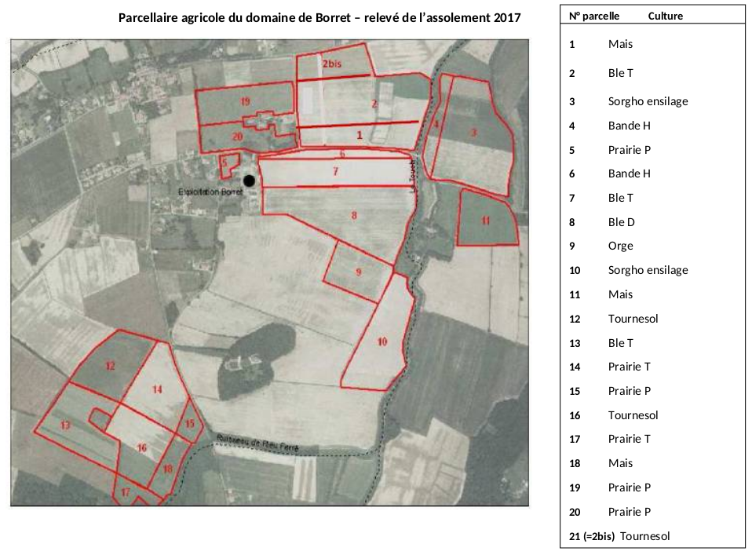
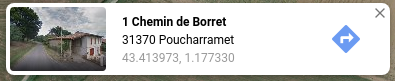
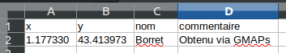
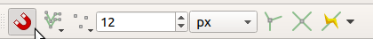

# Introduction

Un Système d'Information Géographique (SIG) est, comme son nom l'indique, un système d'information dédié à l'usage de données spatiales. Il est aussi bien utilisé pour de la consultation, édition et création de données géographiques que pour (et surtout !) de l'analyse spatiale. 

Le SIG est outil qui permet aussi de réaliser des cartes. Pour ce faire, deux modes de représentation des données sont utilisés par ces logiciels :  

- Mode **vecteur** (représentation objet fondée sur des points, lignes, polygones)
- Mode **raster** ou **image** (représentation matricielle avec partition complète de l'espace)

Ces données ont obligatoirement :

1. un système de coordonnées : 
	* il peut s'agir d'un système de coordonnées projetées (ex. Lambert-93 ou code EPSG:2154 pour la France, liée au système géodésique RGF-93) 
	* il peut s'agir d'un système de coordonnées géographiques (ex. WGS-84 ou code EPSG:4326 pour le monde)
2. des coordonnées issues du système précédent (en lat/long ou en mètres)

L'objectif de ce TD introductif est de découvrir un SIG comme QGIS et d'être capable de collecter et visualiser des données spatiales avec cet outil. Pour ce faire, nous allons créer et importer des jeux de données de différentes façons. Vous travaillerez sur l'exploitation agricole (EA) dans laquelle vous allez effectuer votre stage (cf. UE projet DA) mais si elle n'est pas encore connue, nous vous fournirons une autre exploitation. Le but est ici de vous familiariser avec l'outil QGIS en adoptant les bonnes pratiques du domaine.

# Créer un nouveau projet QGIS

Quand vous lancez QGIS, commencez par créer un nouveau projet : 
`Projet > Nouveau`.

## Choisir une projection adaptée

Par défaut votre projet utilise le système de référence mondial WGS-84 (celui du GPS), nom de code EPSG:4326. Dans QGIS, le système de référence du projet est toujours affiché en bas à droite de la fenêtre de QGIS. Vous pouvez donc vérifier votre projection : 

Pour regarder les propriétés de votre projet : `Projet > Propriétés`.

Dans l'onglet `SCR` (Système de Coordonnées de Référence), recherchez  `2154`, soit le code EPSG de la projection Lambert-93 qui est la projection officielle en France depuis 2000 et obligatoire pour les données publiques. 

Si vous voulez en savoir plus sur cette projection, reportez-vous à la [page Wikipedia](https://fr.wikipedia.org/wiki/Projection_conique_conforme_de_Lambert) dédiée.

Une fois la projection Lambert-93 (EPSG:2154) validée, vous pouvez à nouveau vérifier en bas à droite de la fenêtre de QGIS :

Dans l'onglet `Général`, pensez à donner un nom à votre projet, il apparaîtra à côté du nom de la fenêtre QGIS.

Une fois ces manipulations effectuées, vous pouvez sauvegarder votre projet dans votre dossier de travail (ce dossier contiendra également par la suite vos données vecteur/raster). `Projet > Enregistrer sous...`

# Charger des données

L'Institut Géographique National (IGN) est le plus grand producteur français de données spatiales. Il fournit notamment les limites administratives (communes, départements, régions), les fleuves, mais aussi, l'occupation des sols (à travers la BD OCS GE) ou les forêts (à travers les BDTopo et BDForêt). L'IGN s'occupe également de mettre à disposition d'autres jeux de données dont il n'a pas la production à sa charge. C'est le cas du Registre Parcellaire Graphique (RPG) qui sert de référence pour l'attribution des aides de la politique agricole commune (PAC).

Liste indicative des quelques fournisseurs de données (reportez-vous au cours DATA-C pour davantage de sources) :

| Fournisseur        | Type           | Site  |
| ------------- |-------------| -----|
| IGN      | raster/vecteur | [www.ign.fr](https://www.ign.fr) |
| Toulouse      | vecteur |   [data.toulouse-metropole.fr](https://data.toulouse-metropole.fr/) |
| BRGM | raster/vecteur | 	[www.brgm.fr](https://www.brgm.fr) |
| OpenStreetMap | raster/vecteur      | [www.openstreetmap.org](https://www.openstreetmap.org/) |

## Localiser votre exploitation agricole 

*NB : Si vous n'avez pas encore d'exploitation, vous pouvez utiliser l'exploitation de Borret (l'ancienne EA de l'ENSAT !) qui se situe au sud de Poucharramet. Il vous suffit de taper sur Google Maps ou IGN Géoportail l'adresse suivante : '1 chemin de Borret, Poucharramet'*

### Méthode 1 : Via Géoportail de l'IGN

L'IGN a conçu un portail de visualisation de nombreuses sources de données spatiales avec quelques fonctionnalités de localisation : [www.geoportail.gouv.fr/](https://www.geoportail.gouv.fr/)

Commencez par rechercher votre exploitation agricole. N'hésitez pas à choisir comme fond de cartes les photographies aériennes pour vous repérer. Une fois votre exploitation localisée, cliquez sur la molette à droite de l'écran, puis sur `Annoter la carte` et placez votre point (siège de l'EA).

{height=150px}

{height=150px}

Exportez ensuite votre point. Le site Géoportail créera pour vous un fichier au format `kml` qu'il sera possible d'importer dans QGIS. Cependant, le système de référence sera celui du Géoportail lors de la création du point (EPSG:4326). Il faudra donc convertir le système vers l'EPSG:2154 par la suite.

### Méthode 2 : En créer un fichier CSV

Cette méthode permet de créer directement depuis un fichier de type tableur (Excel ou LibreOffice Calc) un couple de coordonnées qu'il sera possible d'importer dans QGIS. 

Pour obtenir les coordonnées X et Y de votre exploitation, vous pouvez utiliser soit le Géoportail soit Google Maps. Une autre façon de les obtenir serait d'aller sur place et d'utiliser un GPS (celui de votre smartphone par exemple).

Si vous faites dans Google Maps un clic droit sur l'endroit qui vous intéresse et que vous cliquez sur "Plus d'infos sur cet endroit", vous verrez alors apparaître les coordonnées dans l'ordre Y et X (et non X et Y - soit la latitude avant la longitude).

{height=50px}

Il ne vous reste plus qu'à les enregistrer dans votre tableur (Excel ou LibreOffice Calc) en faisant bien attention à ajouter le nom de chaque colonne :

{height=50px}

À noter, les coordonnées fournies par Google Maps utilisent le système de coordonnées géographique EPSG:4326.

Enregistrez maintenant votre fichier au format `csv`.

### Ajouter votre exploitation dans QGIS

Dans QGIS 3, il n'y a plus qu'un bouton unique pour ouvrir n'importe quel type de couche.

{height=150px}

- Si vous avez utilisé la méthode 1, sélectionnez l'onglet `Vecteur` et ajoutez votre fichier obtenu via le géoportail. Une autre méthode consiste à glisser/déposer votre fichier `kml` dans la fenêtre QGIS.

- Si vous avez utilisé la méthode 2, sélectionnez l'onglet `Texte Délimité`  et dans la partie `définition de géométrie` choisissez `point`, remplissez les champs X et Y par le nom de vos colonnes X et Y puis dans SCR de la géométrie sélectionnez l'EPSG:4326.

Une nouvelle couche est ainsi ajoutée à votre carte.  Vous pouvez faire un clic droit sur le nom de la couche dans la fenêtre `Couches` et regarder ses propriétés. Dans `Information` vous verrez que la projection est de type `EPSG:4326`. Votre projet étant en Lambert-93 (`EPSG:2154`), il faut veiller à maintenir une cohérence du système de référence entre vos couches. Pour changer cela, allez dans la Boîte à outils de traitements en bas à gauche de QGIS (si la boîte n'est pas ouverte, cliquez sur `Traitement > Boîte à outils`), et recherchez l'algorithme `Reprojeter une couche`. Le SCR cible devra être `EPSG:2154` comme celui de votre projet.

{height=100px}

Enregistrez votre nouvelle couche sous un format de type geopackage (format récent, ouvert, et non propriétaire). Une fois enregistrée, votre nouveau fichier sera chargé automatiquement dans QGIS. Vous pouvez supprimer de la liste des couches l'ancien fichier.

## Ajouter le nom de votre exploitation

Si vous n'avez pas le nom de votre exploitation dans votre fichier vectoriel, il va falloir le modifier. Faites un clic droit sur la couche qui contient votre exploitation et faites `Ouvrir la table d'attributs`. Par défaut vous ne pouvez pas modifier le contenu des champs. Pour cela, il faut d'abord cliquer sur le petit crayon en haut à gauche de la fenêtre, puis vous pouvez ajouter le nom de votre exploitation dans la colonne `Name`. Une fois le nom ajouté, pensez à recliquer sur le petit crayon pour terminer l'édition.

## Modifier l'affichage de votre exploitation
### Afficher le nom

**Objectif : Faire apparaître le nom de l'exploitation sur la carte.**

Faites un clic droit sur la couche, puis `Propriétés`, ensuite, dans l'onglet `Étiquettes`, choisissez Étiqueter avec le champ `Name`. Le nom de l'exploitation doit désormais apparaître sur la carte.

### Changer le type d'icône

**Objectif : Changer le symbole simple (point) par un symbole SVG.**

Toujours dans la fenêtre `Propriétés`, l'onglet `Symbologie` vous permet de changer tout ce qui a trait à l'affichage de vos données. Cliquer sur `Symbole Simple` et changer à `Symbole SVG`. De nombreux symboles sont disponibles, libre à vous de choisir celui que vous préférez. Il est aussi possible d'importer des fichiers SVG.

# Visualiser des données distantes (flux)

Les données enregistrées sur des serveurs distants sont disponibles la plupart du temps à travers des *services Web*. Ces services sont accessibles via une URL (adresse qui pointe vers le serveur) renseignée dans l'application cliente (ici QGIS). Plusieurs types de services existent : (1) le WMS (*Web Map Service*) qui renvoie des données en mode image, (2) le WFS (*Web Feature Service*) qui retourne des données en mode vecteur, et (3) le WCS (*Web Coverage Service*) qui renvoie des données raster avec des fonctions d'interrogation plus avancées que le WMS.

## Afficher les unités géologiques

**Objectif : Ajouter le flux WMS du BRGM relatif à la géologie.**

Rendez-vous sur le site [http://infoterre.brgm.fr/](http://infoterre.brgm.fr/) puis, sur la page des Geoservices OGC. Repérez l'URL du flux WFS relatif à la carte géologique nationale au 1/1.000.000. 

Sous QGIS, `Ajouter une nouvelle couche > WFS > Nouveau`. Donnez un nom et renseignez l'adresse du service WFS (URL). Connectez-vous ensuite au flux pour voir apparaître la carte géologique. Quel est le mode de représentation des données ? raster ou vecteur ? 

Pour obtenir une version image, vous pouvez créer une nouvelle connexion, cette fois avec un service de type WMS/WMTS en précisant l'adresse suivante :
[http://mapsref.brgm.fr/wxs/1GG/BRGM_1M_INSPIRE_geolUnits_geolFaults?language=fr&](http://mapsref.brgm.fr/wxs/1GG/BRGM_1M_INSPIRE_geolUnits_geolFaults?language=fr&)

Pour tout le flux du BRGM (WFS/WMS): [http://geoservices.brgm.fr/geologie](http://geoservices.brgm.fr/geologie)

Pour en savoir plus sur le type de géologie, vous pouvez utiliser l'outil d'identification (l'icône du curseur qui pointe sur un petit _i_) et cliquer sur la couleur de l'unité géologique.

Si vous rencontrez des problèmes d'accès au flux WMS, vous pouvez télécharger la donnée au format `shp` sur le site InfoTerre du BRGM. Et si les liens de téléchargement ne sont pas accessibles, le fichier `geol_1M_fr_surface.zip` est disponible dans le dossier `data` du TD (quelle prévoyance ;-) !).

## Afficher un fond OpenStreetMap ou Google Earth 

**Objectif : Ajouter des fonds de carte gratuits dans QGIS**.

Par défaut QGIS n'intègre pas des fournisseurs de tuiles (Google Maps, Bing, OpenStreetMap) et pourtant, c'est bien pratique !

Deux solutions pour accéder à ces tuiles :

1. Installer un plug-in dédié. Pour cela, dans le menu `Extensions > Installer`, recherchez le plug-in `QuickMapServices` et installez-le. Vérifiez ensuite l'installation et les données disponibles par défaut dans le menu `Internet > QuickMapServices`. Le plug-in donne accès à certaines sources mais pas à Google Maps ou Bings par défaut. Pour cela, il faut récupérer les autres contributions via le menu `settings` du plug-in et l'onglet `More services`.

2. Exécuter un script python dans la console QGIS (`Ctrl+Alt+P`) en copiant-collant les lignes du fichier suivant : [**https://git.io/fjMJq**](https://raw.githubusercontent.com/klakar/QGIS_resources/master/collections/Geosupportsystem/python/qgis_basemaps.py). C'est beau la technique... ;-)

> **A noter** : les données accessibles depuis le plug-in `QuickMapServices` sont définies dans un système de projection dit pseudo-Mercator (EPSG:3857). Il ne s'agit plus de votre système de référence. 

Dans le panneau explorateur sur la gauche de QGIS, vous aurez désormais accès à des dizaines de fournisseurs de tuiles dans la partie `XYZ Tiles`. Double-cliquez sur `Google Satellite` pour avoir uniquement une photo aérienne en fond.

# Créer un vecteur

**Objectif : dessiner les parcelles agricoles**.

Vérifiez dans le menu `Vue > Barre d'outils` que les `Barre d'outils de numérisation`, `Barre d'outils de numérisation avancée` et `accrochage` soient cochées. Ensuite :

- Créer un fichier vectoriel de type polygone (au format geopackage)

    - Menu `Couche > Créer une couche > Nouvelle couche GeoPackage`
    - Choisissez bien le type de géométrie `polygone` et la projection `EPSG:2154`.

- Ajouter un champ de type `Nombre entier` et nommez-le `numparcelle`.

- Ajouter un champ de type `Donnée texte` et nommez-le `description`.

- Ajouter un champ de type `Donnée texte` et nommez-le `assolement`.

- Une fois la couche créée, cliquez sur le petit crayon en haut à gauche dans le menu pour commencer à dessiner votre parcelle.

- Il suffira ensuite d'ajouter une entité polygonale et de dessiner la parcelle.

	

À chaque clic gauche, un nouveau point de votre polygone est ajouté. Pour terminer votre polygone, il suffit de faire un clic droit.

Pour se déplacer pendant la vectorisation, vous pouvez soit dézoomer (avec la molette de la souris), soit changer d'endroit en maintenant la touche espace du clavier tout en déplaçant votre curseur. Vous pouvez alors numériser l'ensemble des parcelles de l'exploitation de Borret. Veillez également à renseigner les attributs des objets (notamment saisir dans la description le type de la parcelle).

## S'appuyer (s'accrocher) sur les polygones déjà créés

L'outil accrochage est indispensable quand on fait de la numérisation. Si vous ne l'avez pas activé, il risque de vous manquer car cet outil permet de s'appuyer sur les polygones déjà créés et agit comme une sorte d'aimant. Si le nouveau point que vous voulez créer est très proche d'un angle d'une parcelle existante, alors l'outil accrochage va comprendre qu'il s'agit du même point. Quel est l'intérêt ? Cela réduit les erreurs. La structure de donnée utilisée par le format GeoPackage étant non topologique (*spaghetti*), il ne vous empêche pas de créer des polygones qui se superposent ou qui ne partagent pas le même segment en cas d'adjacence. Cela peut sembler anodin à première vue mais c'est la source de nombreuses erreurs de calcul par la suite à cause de géométries erronnées (en plus de données redondantes). Il faut donc s'en prémunir au moment de la saisie. 

Afin d'activer la barre d'outils et voir l'icône aimant dans votre fenêtre QGIS, cocher : `Vue > Barre d'outils > Accrochage`

# Géoréférencer une image

**Objectif : Ajouter à votre carte une image obtenue à partir des photos historiques de l'IGN.**

Accéder au site [remonterletemps.ign.fr](https://remonterletemps.ign.fr/) et télécharger une photo aérienne couleur de votre exploitation. Une fois cette donnée téléchargée, nous allons la *géoréférencer* (i.e. lui affecter un système de référence spatiale par transformation géométrique à partir de points d'amer connus dans le système cible) pour l'utiliser en fond de carte sur QGIS.

1. Activer le plugin dans le menu `Extension > Installer > Géoréférenceur GDAL`
2. Vous devriez trouver désormais dans le menu `Raster > Géoréférencer`
3. Suivre la procédure : [https://docs.qgis.org/2.8/fr/docs/training_manual/forestry/map_georeferencing.html](https://docs.qgis.org/2.8/fr/docs/training_manual/forestry/map_georeferencing.html)

